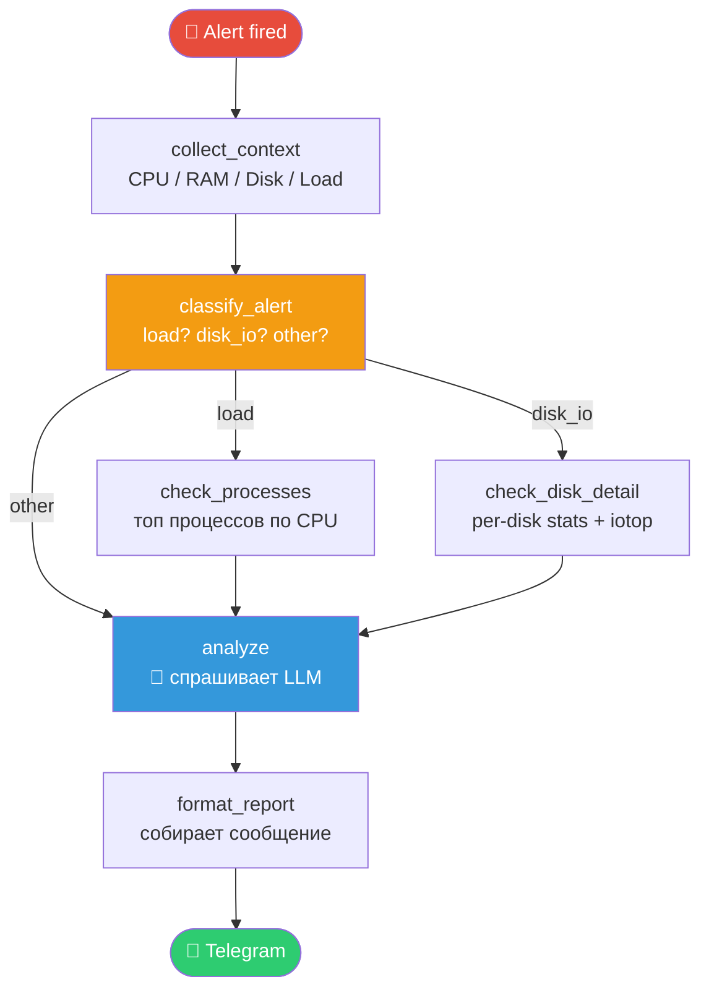

# Diagnostics LangGraph — workflow

```mermaid
flowchart TD
    START([🚨 Alert fired]) --> collect_context

    collect_context["collect_context\nCPU / RAM / Disk / Load"]
    classify_alert["classify_alert\nload? disk_io? other?"]
    check_processes["check_processes\nтоп процессов по CPU"]
    check_disk_detail["check_disk_detail\nper-disk stats + iotop"]
    analyze["analyze\n🤖 спрашивает LLM"]
    format_report["format_report\nсобирает сообщение"]
    END([📨 Telegram])

    collect_context --> classify_alert

    classify_alert -->|load| check_processes
    classify_alert -->|disk_io| check_disk_detail
    classify_alert -->|other| analyze

    check_processes --> analyze
    check_disk_detail --> analyze

    analyze --> format_report
    format_report --> END

    style START fill:#e74c3c,color:#fff
    style END fill:#2ecc71,color:#fff
    style analyze fill:#3498db,color:#fff
    style classify_alert fill:#f39c12,color:#fff
```
