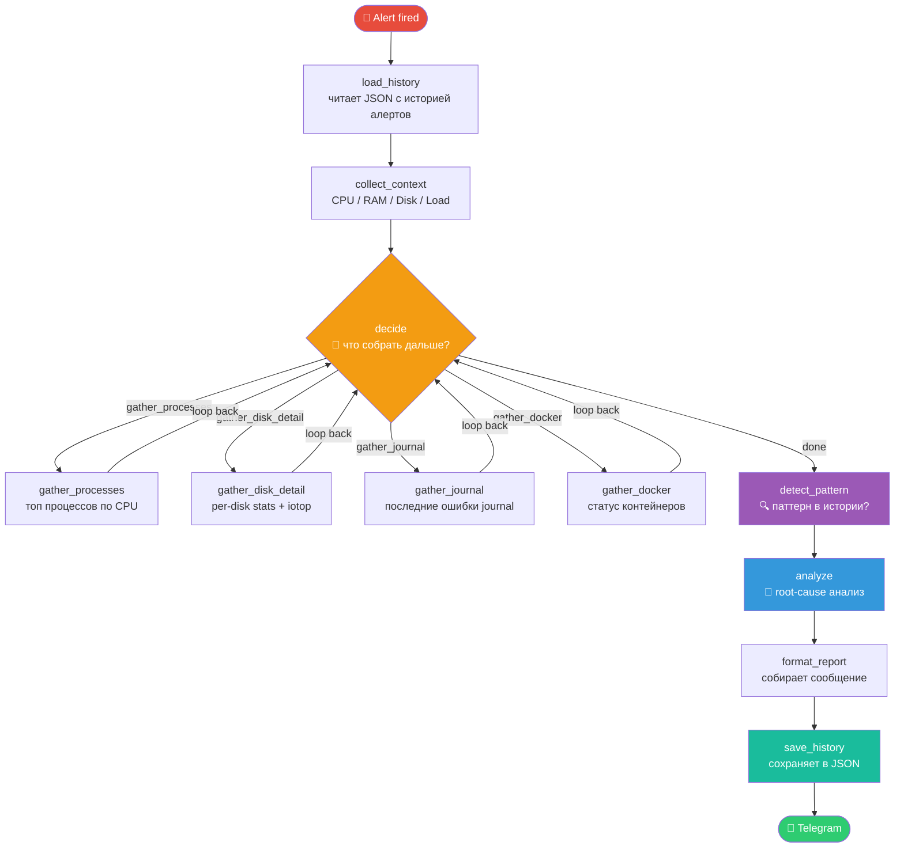

# Diagnostics LangGraph — workflow

## Features
- **Iterative loop** — the LLM decides what to investigate next (max 4 iterations)
- **Persistent memory** — alert history saved to JSON, pattern detection across restarts



## Как работает цикл

```
decide: "нужны процессы"
  → gather_processes → [добавил в state.gathered]
decide: "нужен journal"
  → gather_journal → [добавил в state.gathered]
decide: "достаточно"
  → detect_pattern → analyze → ...
```

Максимум 4 итерации (настраивается через `DIAGNOSTICS_MAX_ITER`).

## Как работает память

После каждого алерта `save_history` дописывает запись в
`/var/lib/system-monitor/alert_history.json`.

При следующем алерте `load_history` загружает историю, и `detect_pattern`
видит сколько раз этот тип алерта уже срабатывал за последние 24 часа.

Пример вывода когда паттерн обнаружен:
```
⚠️ Pattern (5× in 24h): Load spikes occur every ~30 minutes,
   suggesting a recurring cron job or scheduled batch process.
```
