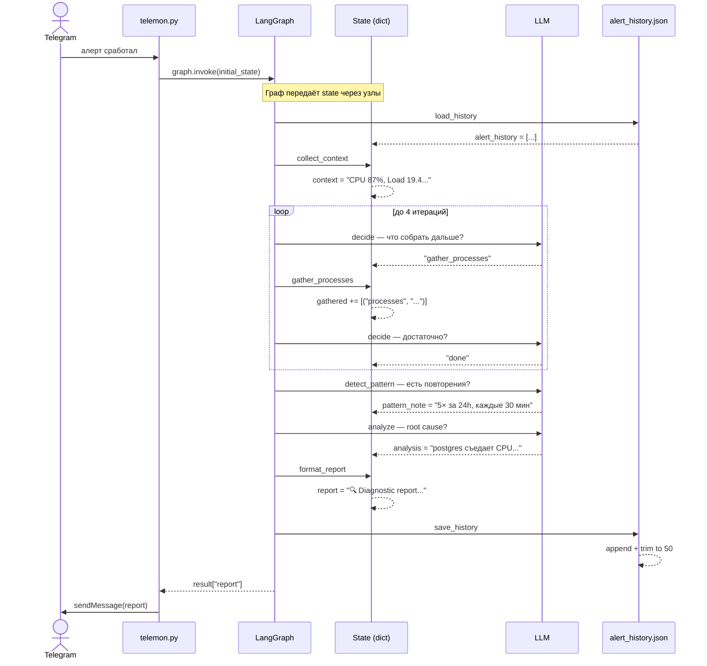

# LangGraph — как это работает (sequence diagram)



---

## Ключевые моменты

**State** — это словарь который живёт всё время работы графа.
Каждый узел читает из него что нужно и дописывает своё поле.
Никаких глобальных переменных — всё через state.

**Цикл** — узел `decide` и узлы `gather_*` образуют петлю.
LLM решает куда идти. Когда говорит `"done"` — петля рвётся,
граф идёт дальше.

**Память** — `load_history` и `save_history` — это просто два узла
на краях графа. Один читает файл в state в начале,
другой пишет обратно в конце. LLM видит историю как обычный текст.
```
