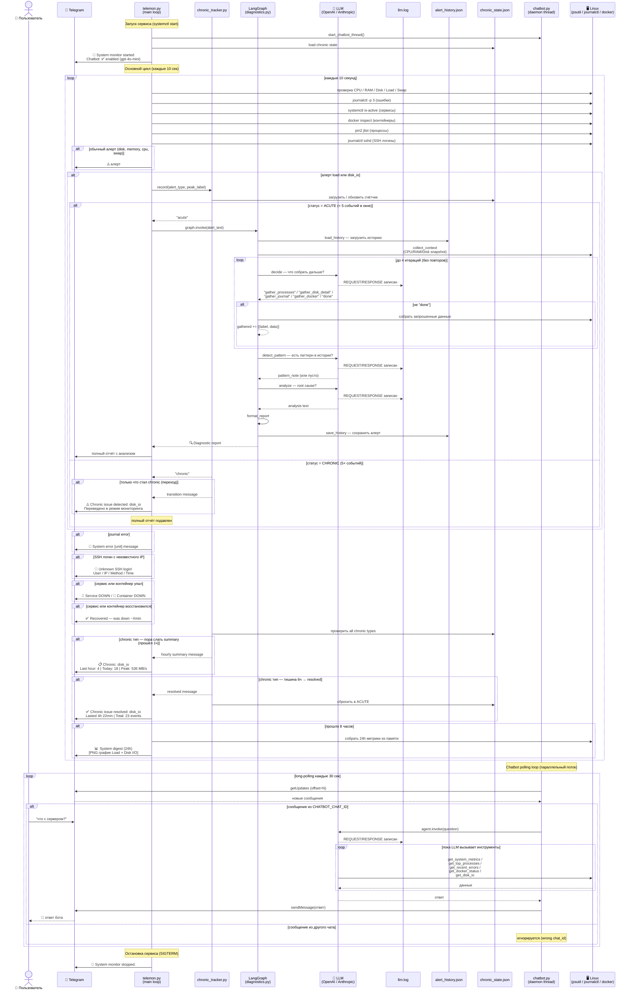

# Telemon — полная диаграмма последовательности

---

## Файлы проекта

| Файл | Роль |
|---|---|
| `telemon.py` | главный цикл, все проверки, отправка алертов |
| `chatbot.py` | daemon thread, отвечает на вопросы в Telegram |
| `diagnostics.py` | LangGraph граф — итеративное расследование алерта |
| `chronic_tracker.py` | state machine ACUTE → CHRONIC → RESOLVED |
| `llm_logger.py` | LangChain callback — логирует все LLM вызовы |
| `alert_history.json` | история алертов для detect_pattern |
| `chronic_state.json` | персистентное состояние chronic tracker |
| `llm.log` | все промпты и ответы LLM verbatim |
